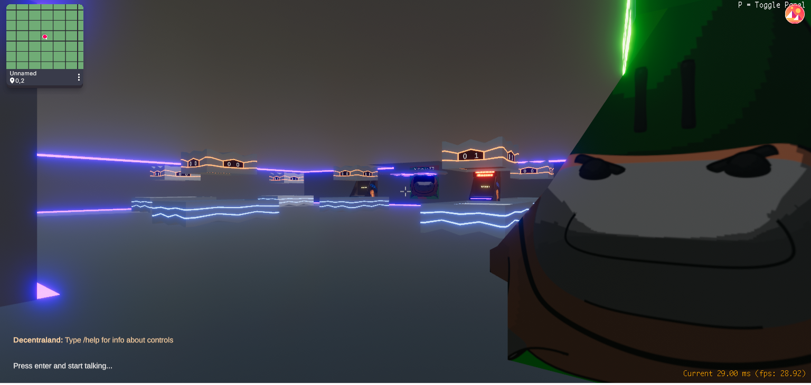

# Neo Arcadia

 
My entry to the Decentraland 2019 2 week game jam.

Neo Arcadia is a social experience based on an arcade store. It has two arcade minigames that work on Decentraland's single player mode, and several disk tables that work on P2P multiplayer mode.

You can play it here:
export-qrc6ni31f.now.sh